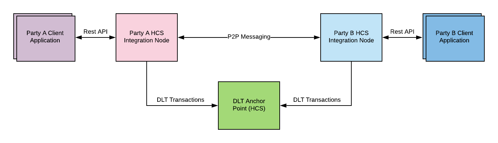
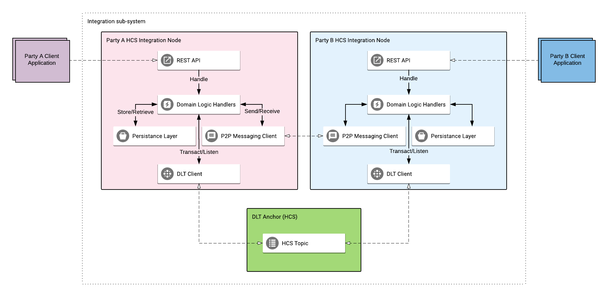
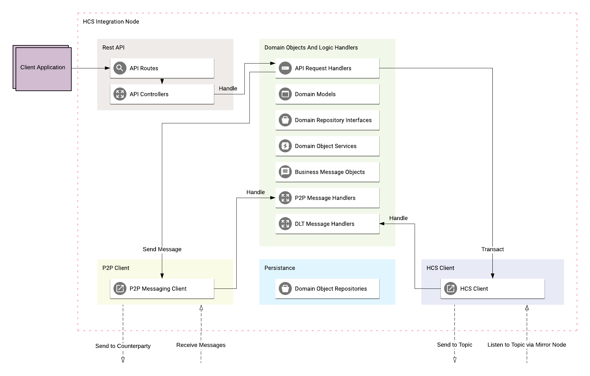
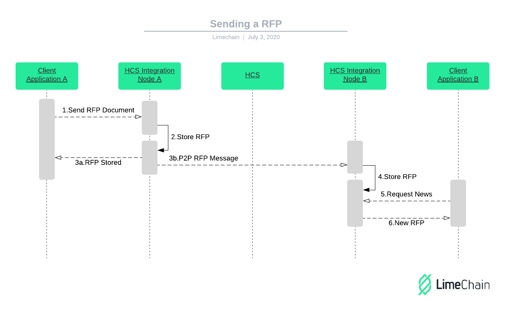
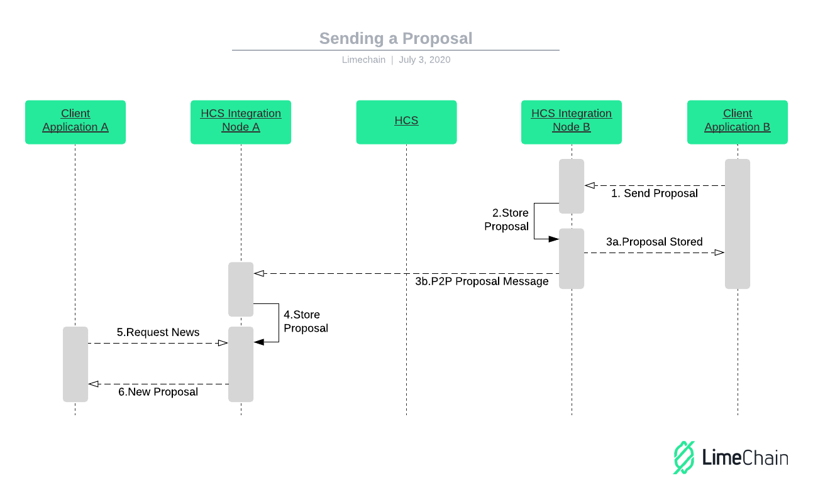
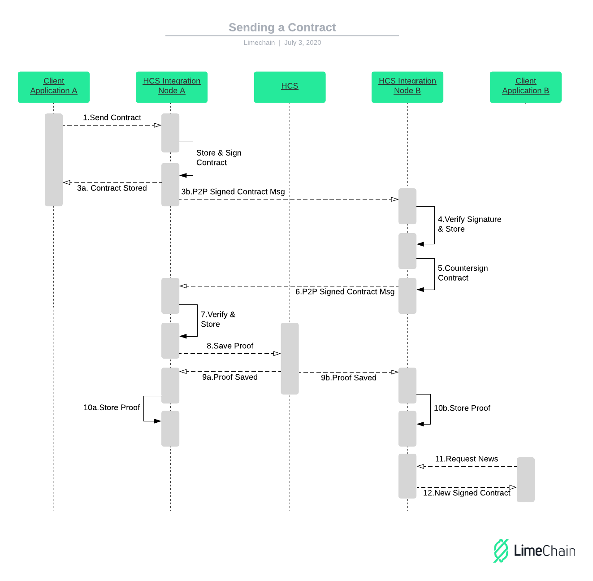
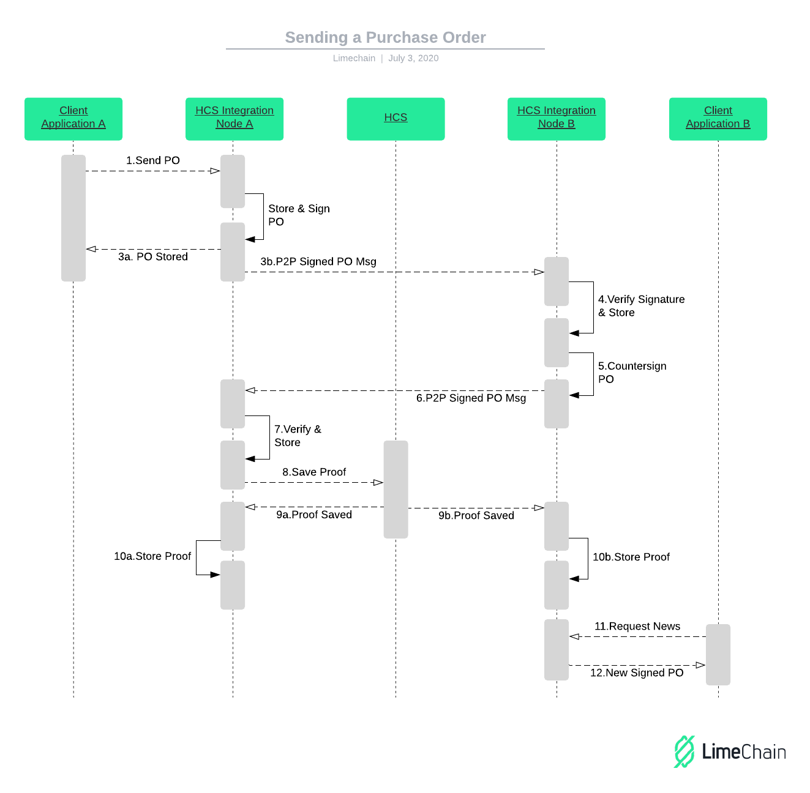

# HCS Integration Node

# Overview

The goal of the HCS Integration Node (HCSIN) is to be a reusable piece in a system allowing for different fidelity client applications to stay trustlessly in sync. The synchronization can entail the following of certain business processes and/or documents/messages exchange. Certain business process milestones (f.e contract signed by all parties) are anchored in public ledger - Hedera HCS - in order to provide a trustless source of truth.

As the business process and communication between two parties are likely to be sensitive in nature (or lead to losses if publicly available) several approach decisions are made:

- The public ledger (HCS) is not the storage of documents nor the main communication layer. The ledger is an immutable trustless source of truth of what crypto-graphical proofs were stored and when. Milestones are recorded in the form of SHA-256 hashes and the necessary crypto-graphical key signatures (indicating milestone agreement)
- The actual document transfer and following of business process logic happens inside the HCS Integration node. The HCS integration node has a p2p messaging component allowing both parties to communicate directly with each other. Every party also has its own storage system allowing for the party to store business process artifacts independently.

# Business Overview
## Benefits of synchronizing through HCSIN for the enterprises 
The communication process between two companies normally involves a lot of manual work, paper trail and requires placing a trust factor in one of the participants. Naturally, manual processes tend to be slow and error-prone. 
Synchronizing the internal systems of record for the companies allows for the following benefits to be achieved:
### Instant following of business processes
With such a synchronization in place employees of enterprise A are no longer required to perform additional actions apart from working in their own system of record (ERP). 
Without it, traditionally the employee needs to export the necessary business process artifacts (for example Purchase Order document) and send them through (normally) email. This introduces additional places for error and delays the business process execution and hinders automation. With HCSIN these delays can be eliminated and processes can be further automated.
### Non-repudiation
Having the HCSIN system in place ensures non-repudiation through cryptography. Agreeing and proving an agreement that certain business process was followed are now governed by cryptographic signatures. No longer can one of the parties claim that they have not agreed a certain terms or processes. With HCSIN will no longer need to spend countless hours searching for the root of misunderstanding. HCSIN - through Hedera Consensus Service - will be able to prove exactly, who, when and what was agreed.
### Owning your data
HCSIN puts the enterprise in complete control of their data. Unlike system of synchronization with a centralized element, all the data is transferred on a need-to-know basis - directly between the involved participants. Every enterprise runs and operates its own HCSIN and connects it to the necessary other parties. As HCSIN becomes part of the enterprise software system all the data is technically and logically contained and stored internally for the organisation.

## Technical advancements made possible by HCS
Hedera Consensus Service enables the HCSIN integration node to hold immutable proof of the business process milestones reached. HCS offers the unique blend of:
- High network speed - very swift confirmation
- Very low cost per transaction
- Ability to write arbitrary data
- Ability to prove the sequence of events

## Video showcase
The process can be seen in action in the video below:
[](http://www.youtube.com/watch?v=r3U1Ui5TbJo "Integrating Microsoft D365 and Google Sheets through Hedera Consensus Service")

# Architecture Overview

## System context level



The system allows for a set of two parties, being represented by their client applications to stay in sync. The client applications communicate with their own dedicated HCSIN through a REST API.

The HCSINs communicate with each other using a P2P messaging protocol. Currently, LibP2P is used as messaging protocol. 

The HCSINs will receive information through one of the three available channels - REST API, P2P messaging system, or HCS. The HCSIN will react by following the business rules embedded in them for the trigger. Example of a trigger that the HCSIN will react to:

- Receiving a new document from the client-side application (and send it to the intended party through p2p message)
- Receiving a new document from p2p communication
- Listening for new HCS topic entries and indicating their availability locally

In addition, the HCSIN will be able to cryptographically sign a message (document) hash and store the proof in HCS.

In the first version of the node, the business logic rules are baked inside the HCSIN itself. As a further abstraction point, the business process specification can be made externally programmable in order to generalize the HCSIN even further.

## Container level



Every HCS integration node has 5 main modules.

The first module is the REST API module. It's main job is to receive and handle the REST API requests from the client application(s) of the party.

The second module is the P2P Messaging Client module. Its main job is to send, receive, and handle P2P messages from the other party.

The third module is the DLT Client. Its main job is to store proofs inside HCS and listen to the communication topic for new proofs stored inside.

The centerpiece of the system is the Domain Logic Handlers module. It is there where the main domain business logic models and handlers are defined and where the business process logic is implemented. Its job is to react to the triggers by invoking the correct business process.

The last module is the persistence module. It is used for storing business process artifacts inside the HCSIN and by the Domain Logic Handlers in order to verify and execute the business process.

## Components level



The five main modules have their own inner components allowing them to work independently and also allowing for extensibility and modifiability.

### REST API

The REST API module has two main components. The first one is the **API Routes** component specifying and enabling the HCSIN to be reached by the client application. The second one is the **API Controllers** - parsing the requests and adding context params where needed. Every controller invokes an API Request Handler Service in order to trigger the correct business process. The current implementation uses the go-chi REST API library.

Swagger UI - [API_URL/swagger/index.html](API_URL/swagger/index.html)

### P2P Messaging Client

The P2P Messaging Client module has one main component - the client itself. The client allows for a new connection to be established, sending a message, and receiving one. The P2P client sends the received messages to a Message Receiver component. In this implementation, we are leveraging the Golang channels in order to streamline the message processing into a queue. Based on the message type received the correct business process handler picks up the message and executes the business process. The current implementation uses the libp2p library.

### HCS Client

The HCS Client module, similarly to the P2P Messaging client, has one main component - the client itself. The client allows for a hedera client to be created and connected to predefined Ed25519 keypair, sending transactions to an HCS topic and reacting to new transactions on the same HCS topic. Similarly to the P2P client, the HCS Client streamlines the processing of reacting to heard transactions via a queue. Based on the message type heard the correct business process handler picks up the message and executes the business process.

### Persistence

The Persistence module contains several similarly looking Domain Object Repositories. These repositories are used to perform the necessary CRUD operations needed by the business logic handlers in the domain module. The current implementation leverages MongoDB as an underlying storage system.

### Domain

The domain module has multiple components and interfaces in order to ensure easy modifiability and extensibility of the system. One component of the system is the Domain Model Objects defining the business process artifacts. Another component is the Repository interfaces for the components, describing what CRUD actions should the persistence layer be implementing, regardless of the storage system underneath it. Domain object services are also available to provide the abilities to standardize the performance of complex actions with the domain objects - for example describing what a hash of a certain object should entail.

Apart from the Domain Model Objects, the domain module also defines the business message models - what types of messages are expected to be sent/received and what fields do they have.

Last but not least, the business process handlers are part of this module. These handlers range from handlers for API requests, to handlers for P2P messages and handlers for new HCS topic transactions seen. These handlers are the main descriptors of the business processes.

# Demo implementation

This section showcases the business processes involved in the developed demo. The main goal is to showcase the synchronization of a tiny bit of the supply chain process. This involves:

- Party A sending Request for Proposal/Quotation (RFP/RFQ)
- Party B sending a Proposal based on the RFP
- Party A creating a contract based on the proposal. Party A sending the contract and cryptographic signature of it. Party B receiving the contract, automatically checking the metadata, and countersigning the contract.
- Party A anchoring the contract (via its hash) and the two signatures in the ledger. Party B recording it has seen the contract in the ledger.
- Party A creating a purchase order (PO) based on a contract. Party A sending the PO and cryptographic signature of it. Party B receiving the PO, automatically checking the metadata and countersigning the PO.
- Party A anchoring the PO (via its hash) and the two signatures in the ledger. Party B recording it has seen the PO in the ledger.

## Business processes explained

The following sequence diagrams will give you a better perspective into the sequence of events in the 4 processes.

RFP:



Proposal:



Contract:



PO:



## Client applications

The client applications can be any software or system that can interact with the HCSIN via its REST API. As this is a fairly straightforward job, it can be done by systems with various levels of complexity. Our showcase of the HCSIN will use Microsoft D365 ERP and Google Spreadsheets (and Google Cloud Functions) as an example of systems with different fidelities.

As you can see from the sequence diagrams above, for the client-side applications the system looks like a simple REST API, and the complexities of the systems are abstracted away to just a simple REST API directing the system to start a simple or complex business process.

# Abstraction points

The following areas have been designed with extensibility and abstraction in mind. This means that new implementation technological choices and business process rules can be applied without modifying (greatly) the underlying architecture and process flow.

## Domain

This is the main place where business process rules are applied. New applications of the HCSIN will probably involve mostly changes in this module. As described in the previous paragraphs, adding a new business process is a matter of constructing the correct domain objects, domain repository interfaces (that need to be implemented by the persistence layer), API handlers, and message handlers. All the handlers have very generic interfaces that make the addition of a new handler quite straightforward.

## P2P Messaging

The p2p messaging interfaces have two main abstraction points that can be used to easily modify the system and add new implementation to the p2p messaging.

### Client library

The system defines a clear interface of what does a p2p client looks like and does not care about the specific implementation under the hood. As long as you follow the interfaces defined in `app/interfaces/common/types.go` you will be able to change the p2p messaging library to a library of your choice.

### Message Encoding

The system is architected in a way that treats the raw message as a byte array. This grants flexibility to the Domain module to chose the underlying encoding of the messages. Current implementation leverages JSON (as the API leverages JSON too), however you can easily chose a different encoding like protobuf.

## Persistence

The domain module defines the interface of the different repositories that need to be able to persist and fetch data. It is the job of this layer to implement them using the technology of their choice. As long as the Domain Repository interfaces are followed the underlying data storage implementation can easily be changed. Currently, the system uses MongoDB, however, this can easily be changed to any storage system of choice.
# Running the node
## Create the crypto keys
- Using a Hedera Operator Account:
    - Set follow environment variables - `HCS_OPERATOR_ID` and `HCS_OPERATOR_PRV_KEY`;
    - Optionally set `HCS_MAINNET` environment variable to `true` in order to create the keypair on mainnet. If it is missing or is not true it will default to testnet.
    Example: `HCS_OPERATOR_ID=0.0.7506 HCS_OPERATOR_PRV_KEY=... ./cryptogen.sh`
- Using own PEM encoded private key:
    - place a PEM encoded file in `config/key.pem`;

If you want to have another keypair, just rename the file and run cryptogen again.

## Creating HCS Topic with threshold keys using Hedera Operator Account
- Set follow environment variables - `HCS_OPERATOR_ID` and `HCS_OPERATOR_PRV_KEY` - they will be used for topic creation;
- Set follow environment variables - `A_PUB_KEY` and `B_PUB_KEY` - they will be given the rights to submit messages in the topic;
- Optionally set `HCS_MAINNET` environment variable to `true` in order to create the topic on mainnet. If it is missing or is not true it will default to testnet.
Example `HCS_OPERATOR_ID=0.0.7506 HCS_OPERATOR_PRV_KEY=... A_PUB_KEY=302a300506032b6570032100086e579c72b037e72bddc3d5c8af5e7b5e5269ab6bb025792a480940ba501b16 B_PUB_KEY=302a300506032b65700321005685758381e67fdaf28b6a992e1e725a707e95280d89eae47fc5132271dc2b1a ./createhcstopic.sh`

## Run your mongo database
`docker run --name hedera-mongo -d -p 27017:27017 -v ~/data:/data/db mongo`

## Create .env file
Create file named `.env` based on the `.env.example`

## Starting the node
Run `./start.sh`

## Running the second peer
1. Backup your `key.pem` and run `./cryptogen`. Rename the new `key.pem` to another name and restore the previous one.
2. Run mongo with different name port and data storage path
3. Create `peer2.env` based on `.env.example`
4. Run `./start-peer2.sh`

## Deployment process - Using Terraform to create HCS nodes in Google Cloud

We will be deploying two Compute Engine VM instances with a started and connected HCS node on each of them.  

**Before we begin, have the following tools locally:**

- gcloud;
- [Terraform](https://learn.hashicorp.com/terraform/getting-started/install.html);
- [jq](https://stedolan.github.io/jq/download/);

**Create a Google Cloud project**

We will start by creating a new project to keep this separate and easy to tear down later. After creating it, copy down the project ID and replace the default project ID with yours in the following places:

`./Makefile`:

```jsx
GCP_PROJECT ?= hcs-integration-node
```

`.terraform/variables.tf`:

```jsx
variable "project_id" {
  default = "hcs-integration-node"
}
```

**Prepare Google Cloud SDK authentication:**

```jsx
$ gcloud auth login
$ gcloud auth application-default login
```

**Switch to newly created project:**

```jsx
$ gcloud config set project PROJECT_ID
```

**Environment variable files:**

Before starting the deployment procedure, make sure you have:

- a Hedera Operator Account variables or a PEM encoded private key placed in `./config/`;
- created HCS topic;
- mongo connection string and db name;
- make sure the API_PORT variables of the both nodes match those specified in `.terraform/variables.tf`;
- activated a log with the following name: `LOG_FILE=hcsnode.log` ;

`P2P_IP` and `PEER_ADDRESS` will be configured during the deployment process.

**Provision the infrastructure:**

The command that will ensure the deployment of the infrastructure is:

```jsx
make provision
```

After successful completion, we will be able to interact with each HCS node through their external IPs.

**Deprovision the infrastructure:**

```jsx
make deprovision
```